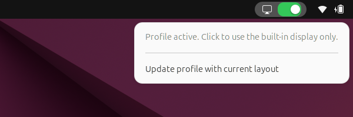

# Magic Mirror


> Mirror, mirror on the wall — one screen or all?


A GNOME Shell extension that puts an Apple-like switch in the top bar. One click
toggles between a saved multi-monitor layout and the built-in display only.

Built with Claude in under one coffee. The coffee was still warm when it shipped.

> [!WARNING]
> Poorly tested. It works on exactly one laptop with two Dell monitors and a
> second computer fighting over them. If you are brave enough to make it two
> laptops — come on, give it a try, and open an issue when the ogre bites.

## Usage

1. Arrange your displays in GNOME Settings the way you like them.
2. Right-click the switch and choose **Save current layout as profile**
   (later: **Update profile with current layout**).
3. Left-click the switch to flip between the profile and the built-in display.



The switch shows three positions:

| Position | Meaning |
| --- | --- |
| Right, green | *Happily ever after.* The saved profile is active. |
| Left | *Back to the swamp.* Only the built-in display is on. |
| Middle, dimmed | *By night one way, by day another.* Some other layout, e.g. changed by hand in Settings. A click applies the profile. |

The whole switch is dimmed and inactive when there is nowhere to go, for example
when the monitors from the profile are not connected. Hover over it to see why.

## Design rules

- **No force.** Layouts are applied through Mutter's `DisplayConfig` D-Bus API,
  exactly like GNOME Settings does. Settings keep working as usual, and the
  extension simply reports a layout it does not recognise as "undefined".
- **Monitors are matched by identity, not by port.** A profile stores vendor,
  product and serial number, so swapping cables between ports does not break it.
- **No runtime dependencies** beyond GNOME Shell itself.
- The profile is plain JSON in `~/.config/magic-mirror/profile.json`.

## Install

From a [release](https://github.com/zniszcz/magic-mirror/releases/latest), as a Debian package:

```sh
sudo apt install ./gnome-shell-extension-magic-mirror_*_all.deb
gnome-extensions enable magic-mirror@zniszczynski.pl
```

Remove it with `sudo apt remove gnome-shell-extension-magic-mirror`.

From source:

```sh
./install.sh            # current user
./install.sh --system   # all users, into /usr/share (uses sudo)
```

Both are safe to run again to upgrade. Afterwards restart GNOME Shell
(X11: <kbd>Alt</kbd>+<kbd>F2</kbd>, `r`; Wayland: log out and back in).

## Uninstall

```sh
./uninstall.sh          # or: ./uninstall.sh --system
```

The saved profile is kept; delete `~/.config/magic-mirror` to remove it too.

## Logs

Messages go to the systemd journal through GNOME Shell:

```sh
journalctl --user -b -g 'Magic Mirror'
```

Debug details appear only when GNOME Shell runs with `G_MESSAGES_DEBUG=all`.

## Development

```sh
make check              # layout logic tests, needs only gjs
```

The project is laid out as a Debian package from the start, so a `.deb` can be
built with `dpkg-buildpackage -us -uc -b` (requires `debhelper`).

## License

0BSD, see [LICENSE](LICENSE). It is compatible with the GPL of GNOME Shell.
Take it, fork it, put it in your swamp.
